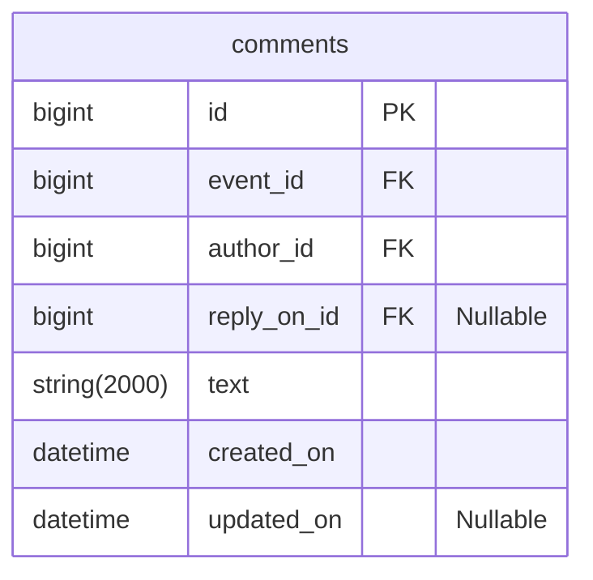

# java-explore-with-me-plus
Template repository for ExploreWithMe project.

---

## Комментарии
Комментарии реализованы на примере TripAdvisor.



### Доступные эндпоинты
#### Public

1. GET ```/events/{eventId}/comments``` - Просмотр комментариев на событии
  - Если событие не найдено, возвращает ошибку 404
  - Событие должно быть опубликовано
    
Параметры:

  - eventId - Id события, к которому нужно вернуть комментарии
  - from - Количество коментариев, которые нужно пропустить для форматирования текущего набора. Default value: 0
  - size - Количество коментариев в наборе. Default value: 10

Статусы ответов:

  - 200 OK + тело ответа в формате CommentDto
  - 400 Bad Request + тело ответа в формате ApiError
  - 404 Not Found + тело ответа в формате ApiError

#### Private

1. GET ```/users/{userId}/comments``` - Просмотр всех комментариев пользователя
    
Параметры:

  - eventId - Id события, к которому нужно вернуть комментарии

Тело запроса:

Статусы ответов:

  - 201 OK + тело ответа в формате CommentDto
  - 400 Bad Request + тело ответа в формате ApiError
  - 404 Not Found + тело ответа в формате ApiError

2. POST ```/users/{userId}/comments``` - Добавление комментария к событию
    
Параметры:

  - eventId - Id события, к которому нужно вернуть комментарии

Тело запроса:

Статусы ответов:

  - 201 OK + тело ответа в формате CommentDto
  - 400 Bad Request + тело ответа в формате ApiError
  - 404 Not Found + тело ответа в формате ApiError

3. POST ```/users/{userId}/comments/{commentId}/reply``` - Добавление ответа к комментарию к событию
    
Параметры:

  - eventId - Id события, к которому нужно вернуть комментарии
  - commentId - Id комментария, к которому нужно оставить комментарии
    
Тело запроса:

Статусы ответов:

  - 201 OK + тело ответа в формате CommentDto
  - 400 Bad Request + тело ответа в формате ApiError
  - 404 Not Found + тело ответа в формате ApiError

4. PATCH ```/events/{eventId}/comments/{commentId}/reply``` - Обновление комментария
    
Параметры:

  - eventId - Id события, к которому нужно вернуть комментарии
  - commentId - Id комментария, к которому нужно оставить комментарии
    
Тело запроса:

Статусы ответов:

  - 201 OK + тело ответа в формате CommentDto
  - 400 Bad Request + тело ответа в формате ApiError
  - 404 Not Found + тело ответа в формате ApiError


5. DELETE ```/events/{eventId}/comments/{commentId}/reply``` - Удаление комментария
    
Параметры:

  - eventId - Id события, к которому нужно вернуть комментарии
  - commentId - Id комментария, к которому нужно оставить комментарии
    
Тело запроса:

Статусы ответов:

  - 201 OK + тело ответа в формате CommentDto
  - 400 Bad Request + тело ответа в формате ApiError
  - 404 Not Found + тело ответа в формате ApiError

#### Admin

1. GET ```/users/{userId}/comments``` - Просмотр всех комментариев по фильтрам
    
Параметры:

  - eventId - Id события, к которому нужно вернуть комментарии

Тело запроса:

Статусы ответов:

  - 201 OK + тело ответа в формате CommentDto
  - 400 Bad Request + тело ответа в формате ApiError
  - 404 Not Found + тело ответа в формате ApiError

 2. POST ```/users/{userId}/comments``` - Добавление комментария к событию
    
Параметры:

  - eventId - Id события, к которому нужно вернуть комментарии

Тело запроса:

Статусы ответов:

  - 201 OK + тело ответа в формате CommentDto
  - 400 Bad Request + тело ответа в формате ApiError
  - 404 Not Found + тело ответа в формате ApiError

3. POST ```/users/{userId}/comments/{commentId}/reply``` - Добавление ответа к комментарию к событию
    
Параметры:

  - eventId - Id события, к которому нужно вернуть комментарии
  - commentId - Id комментария, к которому нужно оставить комментарии
    
Тело запроса:

Статусы ответов:

  - 201 OK + тело ответа в формате CommentDto
  - 400 Bad Request + тело ответа в формате ApiError
  - 404 Not Found + тело ответа в формате ApiError

4. PATCH ```/events/{eventId}/comments/{commentId}/reply``` - Обновление комментария
    
Параметры:

  - eventId - Id события, к которому нужно вернуть комментарии
  - commentId - Id комментария, к которому нужно оставить комментарии
    
Тело запроса:

Статусы ответов:

  - 201 OK + тело ответа в формате CommentDto
  - 400 Bad Request + тело ответа в формате ApiError
  - 404 Not Found + тело ответа в формате ApiError


5. DELETE ```/events/{eventId}/comments/{commentId}/reply``` - Удаление комментария
    
Параметры:

  - eventId - Id события, к которому нужно вернуть комментарии
  - commentId - Id комментария, к которому нужно оставить комментарии
    
Тело запроса:

Статусы ответов:

  - 201 OK + тело ответа в формате CommentDto
  - 400 Bad Request + тело ответа в формате ApiError
  - 404 Not Found + тело ответа в формате ApiError
