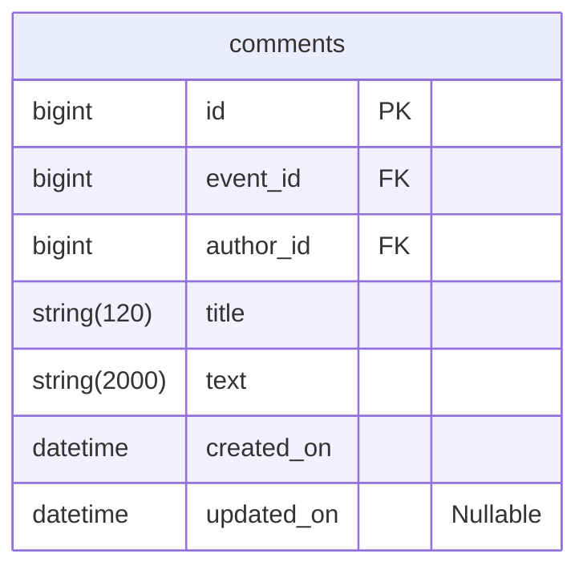

# java-explore-with-me-plus
Template repository for ExploreWithMe project.

---

## Комментарии



### Доступные эндпоинты
#### Public

- Просмотр комментариев на событии
  - Если событие не найдено, возвращает ошибку 404
  - Событие должно быть опубликовано
  GET ```/events/{eventId}/comments```
  - eventId -- Id события, к которому нужно вернуть комментарии
  - from -- Количество коментариев, которые нужно пропустить для форматирования текущего набора. Default value: 0
  - size -- Количество коментариев в наборе. Default value: 10
  Статусы ответов:
  - 200 OK + тело ответа в формате CommentDto
  - 400 Bad Request + тело ответа в формате ApiError
  - 404 Not Found + тело ответа в формате ApiError
