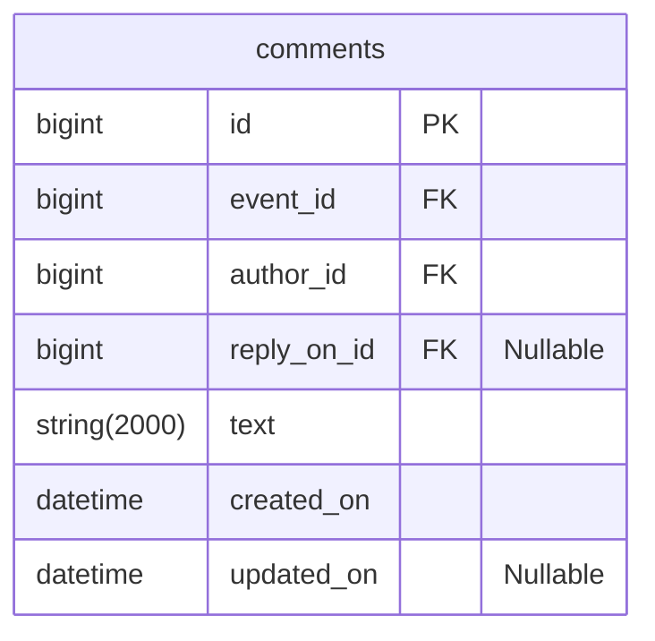

# java-explore-with-me-plus
Template repository for ExploreWithMe project.

---

## Комментарии
Комментарии реализованы на примере TripAdvisor.



### Доступные эндпоинты
---
#### Public
---

###### GET ```/events/{eventId}/comments``` - Просмотр комментариев на событии

- Событие должно быть опубликовано
- Сортировка по убвыванию даты создания сообщения
    
```  
Параметры:
```

  - eventId - Id события, к которому нужно вернуть комментарии
  - from - Количество коментариев, которые нужно пропустить для форматирования текущего набора. Default value: 0
  - size - Количество коментариев в наборе. Default value: 10

```
Статусы ответов:
```
<table>
    <tr>
        <th>Описание</th>
        <th>Код ответа</th>
        <th>Тело ответа</th>
    </tr>
    <tr>
        <td>Запрос обработан успешно</td>
        <td>200 OK</td>
        <td>Collection<CommentDto></td>
    </tr>
    <tr>
        <td>Запрос составлен некорректно</td>
        <td>400 Bad Request</td>
        <td>ApiError</td>
    </tr>
    <tr>
        <td>Событие не найдено</td>
        <td>404 Not Found</td>
        <td>ApiError</td>
    </tr>
</table>

---
#### Private
---

###### GET ```/users/{userId}/comments``` - Просмотр всех комментариев пользователя


```  
Параметры:
```

  - eventId - Id события, к которому нужно вернуть комментарии

```  
Тело запроса:
```


```  
Статусы ответов:
```  

  - 201 OK + тело ответа в формате CommentDto
  - 400 Bad Request + тело ответа в формате ApiError
  - 404 Not Found + тело ответа в формате ApiError


###### POST ```/users/{userId}/comments``` - Добавление комментария к событию
    
```  
Параметры:
```  

  - eventId - Id события, к которому нужно вернуть комментарии

```  
Тело запроса:
```  

```  
Статусы ответов:
```  

  - 201 OK + тело ответа в формате CommentDto
  - 400 Bad Request + тело ответа в формате ApiError
  - 404 Not Found + тело ответа в формате ApiError

###### POST ```/users/{userId}/comments/{commentId}/reply``` - Добавление ответа к комментарию к событию
    
```  
Параметры:
```  

  - eventId - Id события, к которому нужно вернуть комментарии
  - commentId - Id комментария, к которому нужно оставить комментарии
    
```  
Тело запроса:
```  

```  
Статусы ответов:
```  

  - 201 OK + тело ответа в формате CommentDto
  - 400 Bad Request + тело ответа в формате ApiError
  - 404 Not Found + тело ответа в формате ApiError

###### PATCH ```/events/{eventId}/comments/{commentId}/reply``` - Обновление комментария
    
```  
Параметры:
```  

  - eventId - Id события, к которому нужно вернуть комментарии
  - commentId - Id комментария, к которому нужно оставить комментарии
    
```  
Тело запроса:
```  

```  
Статусы ответов:
```  

  - 201 OK + тело ответа в формате CommentDto
  - 400 Bad Request + тело ответа в формате ApiError
  - 404 Not Found + тело ответа в формате ApiError


###### DELETE ```/events/{eventId}/comments/{commentId}/reply``` - Удаление комментария
    
```  
Параметры:
```  

  - eventId - Id события, к которому нужно вернуть комментарии
  - commentId - Id комментария, к которому нужно оставить комментарии
    
```  
Тело запроса:
```  

```  
Статусы ответов:
```  

  - 201 OK + тело ответа в формате CommentDto
  - 400 Bad Request + тело ответа в формате ApiError
  - 404 Not Found + тело ответа в формате ApiError

---
#### Admin
---

###### GET ```/users/{userId}/comments``` - Просмотр всех комментариев по фильтрам
    
```  
Параметры:
```  

  - eventId - Id события, к которому нужно вернуть комментарии

```  
Тело запроса:
```  

```  
Статусы ответов:
```  

  - 201 OK + тело ответа в формате CommentDto
  - 400 Bad Request + тело ответа в формате ApiError
  - 404 Not Found + тело ответа в формате ApiError

###### POST ```/users/{userId}/comments``` - Добавление комментария к событию
    
```  
Параметры:
```  

  - eventId - Id события, к которому нужно вернуть комментарии

```  
Тело запроса:
```  

```  
Статусы ответов:
```  

  - 201 OK + тело ответа в формате CommentDto
  - 400 Bad Request + тело ответа в формате ApiError
  - 404 Not Found + тело ответа в формате ApiError

###### POST ```/users/{userId}/comments/{commentId}/reply``` - Добавление ответа к комментарию к событию
    
```  
Параметры:
```  

  - eventId - Id события, к которому нужно вернуть комментарии
  - commentId - Id комментария, к которому нужно оставить комментарии
    
```  
Тело запроса:
```  

```  
Статусы ответов:
```  

  - 201 OK + тело ответа в формате CommentDto
  - 400 Bad Request + тело ответа в формате ApiError
  - 404 Not Found + тело ответа в формате ApiError

###### PATCH ```/events/{eventId}/comments/{commentId}/reply``` - Обновление комментария
    
```  
Параметры:
```  

  - eventId - Id события, к которому нужно вернуть комментарии
  - commentId - Id комментария, к которому нужно оставить комментарии
    
```  
Тело запроса:
```  

```  
Статусы ответов:
```  

  - 201 OK + тело ответа в формате CommentDto
  - 400 Bad Request + тело ответа в формате ApiError
  - 404 Not Found + тело ответа в формате ApiError


###### DELETE ```/events/{eventId}/comments/{commentId}/reply``` - Удаление комментария
    
```  
Параметры:
```  

  - eventId - Id события, к которому нужно вернуть комментарии
  - commentId - Id комментария, к которому нужно оставить комментарии
    
```  
Тело запроса:
```  

```  
Статусы ответов:
```  

  - 201 OK + тело ответа в формате CommentDto
  - 400 Bad Request + тело ответа в формате ApiError
  - 404 Not Found + тело ответа в формате ApiError
